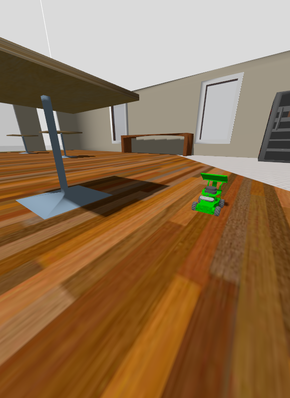

# yahboom_rosmaster

A ROS 2 repository for the Yahboom ROSMaster robot series.

## Overview

This repository contains the ROS 2 package stack for the Yahboom ROSMaster robot.
The root workspace is a metapackage wrapper around the robot description package.



## Package layout

- `yahboom_rosmaster/`
  - `yahboom_rosmaster/` — ROS 2 metapackage
  - `yahboom_rosmaster_description/` — robot description assets and URDF/XACRO model files

## Included packages

- `yahboom_rosmaster`
  - A minimal `ament_cmake` metapackage.
  - Depends on `yahboom_rosmaster_description`.
- `yahboom_rosmaster_description`
  - Contains robot meshes, URDF/XACRO files, launch descriptions, and RViz configs.

## Requirements

- ROS 2 distribution with `ament_cmake` (for example: Humble, Iron, or later)
- `colcon` build tools
- Linux-based ROS 2 environment

## Build instructions

From the workspace root:

```bash
cd ~/ros2_ws/src/yahboom_rosmaster
source /opt/ros/<your_ros2_distro>/setup.bash
colcon build --packages-select yahboom_rosmaster yahboom_rosmaster_description
source install/setup.bash
```

If the workspace root is `~/ros2_ws`, use:

```bash
cd ~/ros2_ws
source /opt/ros/<your_ros2_distro>/setup.bash
colcon build --packages-select yahboom_rosmaster yahboom_rosmaster_description
source install/setup.bash
```

### 🍏 Running under macOS (Apple Silicon / UTM)
If you are running this simulation inside an Ubuntu Linux virtual machine on Apple Silicon (M1/M2/M3/M4) via UTM with VirGL hardware acceleration enabled, you need to set specific Mesa, Ogre, and Qt environment variables to prevent a black/blank Gazebo viewport and application crashes.

Add the following environment variables to your shell configuration (~/.bashrc):
```bash
# Fix blank viewport issue under Mesa VirGL by forcing copy render targets
export OGRE_RTT_MODE=Copy

# Force Mesa drivers to report OpenGL 3.3 and GLSL 3.30 support required by Gazebo
export MESA_GL_VERSION_OVERRIDE=3.3
export MESA_GLSL_VERSION_OVERRIDE=330

# Fix depth-buffer z-fighting flickering under Mesa VirGL
export MESA_GL_DIRTY_PIXMAPS=1
export MESA_LOADER_DRIVER_OVERRIDE=virgl

# Ensure X11/XWayland rendering stability for Qt applications inside UTM
export QT_QPA_PLATFORM=xcb

# Bind Gazebo transport loopback explicitly to single-host local IPC
export GZ_IP=127.0.0.1
export GZ_PARTITION=gazebo_local
```

After adding these, reload your shell configuration:

```bash
source ~/.bashrc
```

## How to use

* Launch the simulation with gazebo
```bash
cd  ~/ros2_ws
bash src/oom_rosmaster/yahboom_rosmaster_bringup/scripts/rosmaster_x3_gazebo.sh
```

* Move it on its left
```bash
ros2 topic pub /mecanum_drive_controller/cmd_vel geometry_msgs/msg/TwistStamped "{header: {stamp: {sec: $(date +%s), nanosec: 0}, frame_id: ''}, twist: {linear: {x: 0.0, y: 0.1, z: 0.0}, angular: {x: 0.0, y: 0.0, z: 0.0}}}"
```

## License

BSD-3-Clause

---

Author: Alessandro Tiozzo
Date: 2026-06-25
